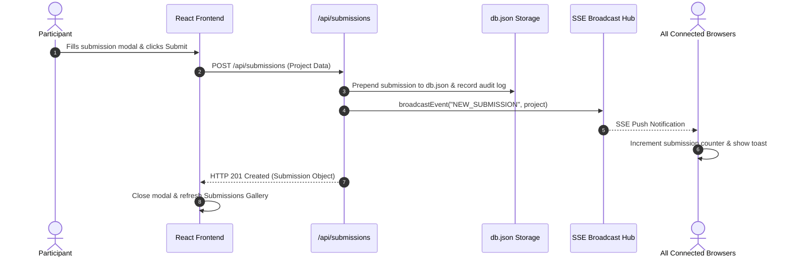
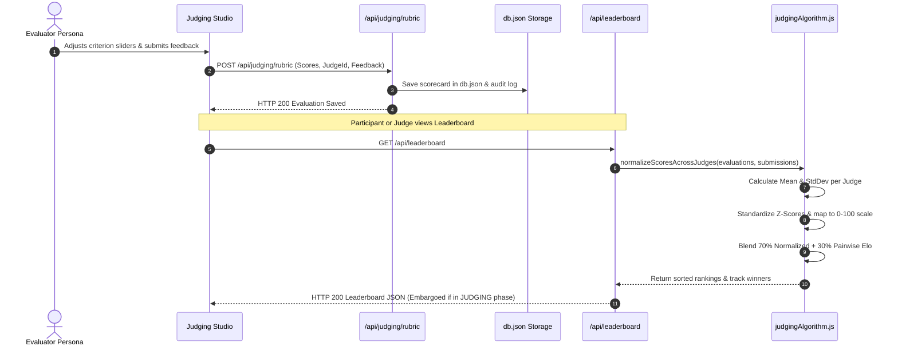

# 🏛️ Dogfood 2026: System Architecture & Technical Specification

> **Engineering Design Document: System Architecture, Component Topology, and Major Technical Decisions**

---

## 📑 Table of Contents

1. [High-Level Architectural Topology](#1-high-level-architectural-topology)
2. [Major Technical Decisions & Trade-Off Analysis](#2-major-technical-decisions--trade-off-analysis)
   - [Decision 1: Zero External DBMS (Atomic JSON Engine vs. PostgreSQL/MongoDB)](#decision-1-zero-external-dbms-atomic-json-engine-vs-postgresqlmongodb)
   - [Decision 2: Pure Vanilla CSS Design System vs. TailwindCSS](#decision-2-pure-vanilla-css-design-system-vs-tailwindcss)
   - [Decision 3: Server-Sent Events (SSE) vs. WebSockets](#decision-3-server-sent-events-sse-vs-websockets)
   - [Decision 4: Dual-Engine Evaluation (Rubrics + Pairwise Elo) vs. Single Model](#decision-4-dual-engine-evaluation-rubrics--pairwise-elo-vs-single-model)
   - [Decision 5: Client-Side Role Persona Switching vs. Session-Based Auth](#decision-5-client-side-role-persona-switching-vs-session-based-auth)
   - [Decision 6: Multi-Stage Alpine Docker Build with Non-Root Security](#decision-6-multi-stage-alpine-docker-build-with-non-root-security)
   - [Decision 7: Native Node.js Test Runner (`node:test`) vs. Jest / Vitest](#decision-7-native-nodejs-test-runner-nodetest-vs-jest--vitest)
3. [Frontend System Architecture (React 18 + Vite)](#3-frontend-system-architecture-react-18--vite)
   - [Global State Machine (`HackathonContext.jsx`)](#global-state-machine-hackathoncontextjsx)
   - [Component & View Hierarchy (11 Views & 9 Modals)](#component--view-hierarchy-11-views--9-modals)
   - [Obsidian & Cyberpunk Design System](#obsidian--cyberpunk-design-system)
4. [Backend API Architecture (Node.js ES Modules & Express)](#4-backend-api-architecture-nodejs-es-modules--express)
   - [Modular Router Architecture](#modular-router-architecture)
   - [Real-Time SSE Event Stream Hub](#real-time-sse-event-stream-hub)
   - [Atomic Storage Subsystem (`server/db.js`)](#atomic-storage-subsystem-serverdbjs)
5. [Scientific Computational Engine (`server/judgingAlgorithm.js`)](#5-scientific-computational-engine-serverjudgingalgorithmjs)
6. [Container & Deployment Topology](#6-container--deployment-topology)
7. [System Sequence & Data Flow Diagrams](#7-system-sequence--data-flow-diagrams)

---

## 1. High-Level Architectural Topology

Dogfood 2026 is architected as an **independent, self-contained monolithic micro-platform**. It unifies frontend presentation, REST API endpoints, real-time push telemetry, mathematical scoring algorithms, and persistent data storage into a single deployable container.

```mermaid
graph TD
    subgraph Client Tier (Browser)
        ViteApp["React 18 Single Page Application"]
        GlobalCtx["HackathonContext (State & Actions)"]
        SSEClient["SSE Stream Listener (/api/events)"]
        VanillaCSS["Obsidian Cyber Design Tokens (index.css)"]
        ViteApp --> GlobalCtx
        GlobalCtx --> SSEClient
        ViteApp --> VanillaCSS
    end

    subgraph Server Tier (Express.js on Node 20)
        HTTPServer["Express Application (Port 5000)"]
        StaticProxy["Static Asset Server (client/dist)"]
        SSEPool["SSE Active Connection Pool"]
        
        subgraph REST Routers
            R_Hackathon["/api/hackathon (Config, Phases, Broadcasts)"]
            R_Submissions["/api/submissions (CRUD, Filters, Upvotes)"]
            R_Judging["/api/judging (Rubrics, Duels, Progress)"]
            R_Leaderboard["/api/leaderboard (Normalization, Standings)"]
            R_Teams["/api/teams (Squads, Seekers, Members)"]
            R_Analytics["/api/analytics (Matrix, Health, Logs)"]
            R_Export["/api/export (CSV & JSON Streams)"]
        end
        
        HTTPServer --> StaticProxy
        HTTPServer --> SSEPool
        HTTPServer --> R_Hackathon
        HTTPServer --> R_Submissions
        HTTPServer --> R_Judging
        HTTPServer --> R_Leaderboard
        HTTPServer --> R_Teams
        HTTPServer --> R_Analytics
        HTTPServer --> R_Export
    end

    subgraph Computational Tier
        JEngine["Judging Algorithm Engine<br/>- Weighted Rubrics<br/>- Z-Score Normalization<br/>- Bradley-Terry Elo Rating"]
        DBSubsystem["Storage Subsystem<br/>- In-Memory Cache (dbCache)<br/>- Atomic Write-Through Engine"]
    end

    subgraph Storage Tier (Filesystem Volume)
        DBFile[("data/db.json<br/>(Mounted via Docker Volume dogfood_data)")]
    end

    GlobalCtx -- "HTTP REST Requests" --> HTTPServer
    SSEPool -- "Unidirectional Event Stream" --> SSEClient
    R_Judging --> JEngine
    R_Leaderboard --> JEngine
    R_Hackathon --> DBSubsystem
    R_Submissions --> DBSubsystem
    R_Judging --> DBSubsystem
    R_Teams --> DBSubsystem
    R_Analytics --> DBSubsystem
    R_Export --> DBSubsystem
    DBSubsystem <--> DBFile
```

---

## 2. Major Technical Decisions & Trade-Off Analysis

Every architectural choice in Dogfood 2026 was evaluated against the project's core philosophy: **zero external dependencies, 1-command deployability, resilience under pressure, and scientific fairness.**

### Decision 1: Zero External DBMS (Atomic JSON Engine vs. PostgreSQL/MongoDB)
- **Decision**: Implemented an in-memory cached, atomic write-through JSON document database (`server/db.js`) persisted to `data/db.json`.
- **Alternatives Considered**: PostgreSQL, MongoDB, SQLite with native bindings (`better-sqlite3`), Redis.
- **Rationale**:
  - Hackathons require instantaneous, zero-configuration startup. Requiring users to configure external database containers, run migration scripts, or provision cloud credentials increases setup friction and failure points.
  - Native C/C++ SQLite bindings often fail to compile in cross-platform environments (e.g., Windows Node-gyp errors, Alpine musl libc compilation mismatches).
  - The total dataset for a 72-hour hackathon (dozens of teams, hundreds of submissions and evaluations) fits comfortably in memory (<10 MB).
- **Trade-Offs & Mitigations**:
  - *Trade-off*: File writes could theoretically corrupt if interrupted mid-stream.
  - *Mitigation*: Writes are performed synchronously via `fs.writeFileSync` with atomic file flushing. An in-memory cache (`dbCache`) handles all read queries with sub-millisecond latency. On boot, `loadDatabase()` validates JSON integrity and automatically self-heals via `seedDatabase()` if corruption is detected.

---

### Decision 2: Pure Vanilla CSS Design System vs. TailwindCSS
- **Decision**: Developed a 100% custom Obsidian Cyberpunk design system using semantic Vanilla CSS ([client/src/index.css](file:///c:/Users/Rushabh%20Mahajan/Documents/VS%20Code/dogfood-hackathon/client/src/index.css)).
- **Alternatives Considered**: TailwindCSS, Bootstrap, Material UI, Chakra UI.
- **Rationale**:
  - TailwindCSS introduces utility-class clutter in JSX templates, making code review and component reasoning difficult during rapid pair programming.
  - Third-party component libraries impose generic aesthetics that look like enterprise dashboards rather than an electric, high-stakes 72-hour engineering arena.
  - Semantic CSS with custom properties allows precise control over glassmorphism (`backdrop-filter: blur(12px)`), animated CRT scanlines, background noise grain, glowing neon cyan/magenta borders, and the running cyber marquee news ticker.
- **Trade-Offs & Mitigations**:
  - *Trade-off*: Requires writing custom CSS selectors and responsive grid utilities.
  - *Mitigation*: Encapsulated design tokens (colors, fonts, borders, shadows, animations) at the root level (`:root`), ensuring clean, reusable, and maintainable styling throughout all 11 views and 9 modals.

---

### Decision 3: Server-Sent Events (SSE) vs. WebSockets
- **Decision**: Implemented real-time push telemetry via native Server-Sent Events (`/api/events`).
- **Alternatives Considered**: WebSockets (`ws`, `Socket.io`), Long Polling.
- **Rationale**:
  - The hackathon telemetry model is predominantly **unidirectional server-to-client push** (organizer broadcasts, phase transitions, live upvote counter increments, ticket claims).
  - SSE operates over standard HTTP/1.1 and HTTP/2 without requiring protocol upgrades. This guarantees that reverse proxies (Nginx, Caddy, Cloudflare, Traefik) and enterprise corporate firewalls route the stream without dropping connections.
  - Web browsers support SSE natively through the standard `EventSource` API, which features automatic reconnection and retry logic without external client libraries.
- **Trade-Offs & Mitigations**:
  - *Trade-off*: SSE cannot receive messages from client to server over the same stream.
  - *Mitigation*: Client actions (submitting votes, tickets, projects) use standard REST `POST`/`PATCH` endpoints, keeping the request-response lifecycle clean and RESTful.

---

### Decision 4: Dual-Engine Evaluation (Rubrics + Pairwise Elo) vs. Single Model
- **Decision**: Combined weighted rubric evaluation with Bradley-Terry Pairwise Elo duels into a $70/30$ composite rating model.
- **Alternatives Considered**: Pure Rubric Scoring, Pure Pairwise Voting, Borda Count.
- **Rationale**:
  - *Why not Rubric alone?* Rubric scoring suffers from severe judge bias (harsh vs. lenient baseline differences) and score compression where fractional differences create noisy rankings.
  - *Why not Pairwise alone?* Pure pairwise comparisons require $O(N \log N)$ or hundreds of duels to order the entire field, and they provide zero diagnostic rubric feedback to participants.
  - *The Hybrid Solution*: Rubrics provide structured, multi-dimensional feedback across explicit criteria (Architecture, Polish, Innovation), while pairwise duels allow judges to make rapid 1v1 comparisons that break ties and validate top contenders.
- **Trade-Offs & Mitigations**:
  - *Trade-off*: Judges have two evaluation interfaces to engage with.
  - *Mitigation*: The **Judging Studio** provides dedicated action cards for each mode with clear progress counters (`rubricsCompleted` and `duelsCompleted`).

---

### Decision 5: Client-Side Role Persona Switching vs. Session-Based Auth
- **Decision**: Provided a zero-latency top navigation Role Switcher (`Participant`, `Judge` [4 personas], `Organizer`) managed via `HackathonContext.jsx`.
- **Alternatives Considered**: Passport.js, JWT tokens, OAuth2, Auth0, Cookie-based sessions.
- **Rationale**:
  - During hackathon demonstrations, judges, organizers, and evaluators need to test different user journeys rapidly without logging out, resetting passwords, or managing external authentication servers.
  - Eliminates external identity provider downtime and configuration overhead.
- **Trade-Offs & Mitigations**:
  - *Trade-off*: Client-side role selection is unsuitable for hostile, untrusted environments.
  - *Mitigation*: Every administrative action (phase change, announcement broadcast, rubric submission) is recorded in the immutable `auditLogs` collection with a timestamp and author attribution, ensuring complete operational transparency.

---

### Decision 6: Multi-Stage Alpine Docker Build with Non-Root Security
- **Decision**: Architected a 2-stage `Dockerfile` using `node:20-alpine`, separating the client build environment from the minimal runtime container, executed under the unprivileged `node` user.
- **Alternatives Considered**: Single-stage Ubuntu image, serving client and server from separate containers.
- **Rationale**:
  - Produces a lightweight production image (<150 MB) that downloads and launches in seconds.
  - Monolithic single-container serving eliminates cross-origin CORS latency and simplifies reverse proxy configuration.
  - Running as `USER node` eliminates container escape privileges, satisfying production container security standards.
- **Trade-Offs & Mitigations**:
  - *Trade-off*: Requires Vite client compilation before server launch.
  - *Mitigation*: Docker build cache separates dependency installation (`package.json`) from source copying, allowing near-instant incremental rebuilds.

---

### Decision 7: Native Node.js Test Runner (`node:test`) vs. Jest / Vitest
- **Decision**: Authored all unit, integration, and constraint tests using Node.js's native test runner (`node:test`) and strict assertions (`node:assert/strict`).
- **Alternatives Considered**: Jest, Mocha/Chai, Vitest.
- **Rationale**:
  - Node 18+ and Node 20+ feature a built-in, lightning-fast test runner that requires **zero devDependencies**.
  - Eliminates babel compilation, ts-node wrappers, and ESM module mocking configuration issues.
  - Anyone cloning the repository can run `npm test` without installing heavy external testing frameworks.

---

## 3. Frontend System Architecture (React 18 + Vite)

### Global State Machine (`HackathonContext.jsx`)
The frontend client uses a central provider ([HackathonContext.jsx](file:///c:/Users/Rushabh%20Mahajan/Documents/VS%20Code/dogfood-hackathon/client/src/context/HackathonContext.jsx)) wrapping the entire application:

```javascript
export function HackathonProvider({ children }) {
  // Current active role & judge persona
  const [currentRole, setCurrentRole] = useState('JUDGE');
  const [selectedJudgeId, setSelectedJudgeId] = useState('judge-1');

  // Core entities
  const [config, setConfig] = useState(null);
  const [tracks, setTracks] = useState([]);
  const [criteria, setCriteria] = useState([]);
  const [submissions, setSubmissions] = useState([]);
  const [teams, setTeams] = useState([]);
  const [evaluations, setEvaluations] = useState([]);
  const [schedule, setSchedule] = useState([]);
  const [announcements, setAnnouncements] = useState([]);
  const [mentorTickets, setMentorTickets] = useState([]);
  const [leaderboard, setLeaderboard] = useState(null);

  // Active navigation tab
  const [activeTab, setActiveTab] = useState('overview');
  ...
}
```

### Component & View Hierarchy (11 Views & 9 Modals)
The user interface is segmented into 11 purpose-built views and 9 specialized interactive modals:

```
App.jsx (Layout Shell)
├── Navbar (Role dropdown, Phase badge, Action CTAs)
├── CountdownBanner (Real-time 72h phase HUD & timeline stepper)
├── Viewport (Tab Routing)
│   ├── OverviewView (Telemetry counters, track cards, rules, recent projects)
│   ├── ScheduleTimelineView (72-hour milestone calendar)
│   ├── PrizesView ($45,000 prize breakdown, sponsor bounties, criteria)
│   ├── SubmissionsView (Search, track filter, tech tags, upvote cards)
│   ├── JudgingStudioView (Judge workbench, rubric progress, duel launcher)
│   ├── LeaderboardView (Rankings, track winners, embargo shield)
│   ├── TeamsView (Squad recruitment, member rosters, hacker seekers)
│   ├── ResourcesView (Docker templates, starter kits, API guides)
│   ├── MentorshipView (24/7 helpdesk queue, ticket claim/resolve)
│   ├── FaqView (Knowledge base & community AMA form)
│   └── AnalyticsDashboardView (Judge coverage matrix & live audit trail)
├── Interactive Modals
│   ├── SubmissionModal (Project submission with live markdown preview)
│   ├── ProjectDetailModal (Full project details & embedded video)
│   ├── RubricScoringModal (5-criterion weighted slider scoring)
│   ├── PairwiseDuelModal (Head-to-head Bradley-Terry comparison arena)
│   ├── TeamMatchmakerModal (Squad creation with open role tags)
│   ├── SeekerProfileModal (Hacker skill registration)
│   ├── RequestMentorModal (Participant help ticket submission)
│   ├── BroadcastModal (Organizer live broadcast composer)
│   └── ExportModal (CSV & JSON export prompt)
└── ToastContainer (Floating real-time notifications)
```

### Obsidian & Cyberpunk Design System
The visual presentation is powered by [index.css](file:///c:/Users/Rushabh%20Mahajan/Documents/VS%20Code/dogfood-hackathon/client/src/index.css):
- **Color Variables**: High-contrast cyber palette (`--df-bg: #0a0d14`, `--df-cyan: #00E5D0`, `--df-violet: #8b5cf6`, `--df-magenta: #ec4899`, `--df-amber: #f59e0b`).
- **Typography**: Paired Google Fonts (`Inter` for high-density UI text, `JetBrains Mono` for telemetry counters and technical badges).
- **Atmospheric Effects**: Hardware-accelerated CSS scanlines (`.df-scanlines`), subtle film grain (`.df-grain`), glassmorphic panels (`backdrop-filter: blur(12px)`), and a smooth news ticker marquee.

---

## 4. Backend API Architecture (Node.js ES Modules & Express)

### Modular Router Architecture
The backend is structured into modular Express routers mounted in `server/index.js`:

| Router File | Mount Path | Purpose |
|---|---|---|
| `routes/hackathon.js` | `/api/hackathon` | Config, phase transitions, announcements, mentorship tickets, hacker seekers. |
| `routes/submissions.js` | `/api/submissions` | Project submission CRUD, fulltext search, track filtering, and community upvotes. |
| `routes/judging.js` | `/api/judging` | Rubric scorecard submission, evaluator progress calculation, pairwise match generation and voting. |
| `routes/leaderboard.js` | `/api/leaderboard` | Z-score normalization execution, track standings grouping, and embargo protection. |
| `routes/teams.js` | `/api/teams` | Squad registration, open roles management, and member join requests. |
| `routes/analytics.js` | `/api/analytics` | System telemetry, track distributions, and the judge-submission coverage matrix. |
| `routes/export.js` | `/api/export` | CSV leaderboard generation and complete JSON database dumps. |

### Real-Time SSE Event Stream Hub
In `server/index.js`, an in-memory client connection pool manages Server-Sent Events:
```javascript
let sseClients = [];

app.get('/api/events', (req, res) => {
  res.setHeader('Content-Type', 'text/event-stream');
  res.setHeader('Cache-Control', 'no-cache');
  res.setHeader('Connection', 'keep-alive');

  const clientId = Date.now();
  const newClient = { id: clientId, res };
  sseClients.push(newClient);

  res.write(`data: ${JSON.stringify({ type: 'CONNECTED', message: 'Dogfood live stream active' })}\n\n`);

  req.on('close', () => {
    sseClients = sseClients.filter(c => c.id !== clientId);
  });
});

export function broadcastEvent(type, payload) {
  sseClients.forEach(c => {
    try {
      c.res.write(`data: ${JSON.stringify({ type, payload, timestamp: new Date().toISOString() })}\n\n`);
    } catch (err) {
      console.error('[SSE] Broadcast error:', err);
    }
  });
}
```

### Atomic Storage Subsystem (`server/db.js`)
The database engine guarantees atomic updates and fast reads:
- `db.get()`: Returns the cached in-memory database object (`dbCache`).
- `db.save(data)`: Synchronously serializes `data` to `data/db.json` via `fs.writeFileSync`.
- `db.reset()`: Overwrites current state with a fresh copy of `server/seedData.js`.

---

## 5. Scientific Computational Engine (`server/judgingAlgorithm.js`)

All statistical normalization and pairwise rating logic resides in [server/judgingAlgorithm.js](file:///c:/Users/Rushabh%20Mahajan/Documents/VS%20Code/dogfood-hackathon/server/judgingAlgorithm.js):

1. **`calculateRubricScore(scores, criteria)`**: Computes weighted averages across the 5 evaluation criteria.
2. **`normalizeScoresAcrossJudges(evaluations, submissions, criteria)`**:
   - Calculates $\mu_j$ (mean) and $\sigma_j$ (standard deviation) per judge.
   - Calculates standardized $Z = \frac{\text{RawScore} - \mu_j}{\sigma_j}$.
   - Remaps into a centered $[0, 100]$ score: $\text{clamp}(50 + 16Z, 0, 100)$.
   - Scales Pairwise Elo ($R$) to 100-point equivalent: $\frac{R}{16}$.
   - Computes blended composite: $(0.70 \times \text{Normalized}) + (0.30 \times \text{EloRatio})$.
   - Sorts descending and assigns sequential ranks ($1, 2, 3\dots$).
3. **`updateEloRatings(winnerScore, loserScore, isDraw, k)`**:
   - Calculates logistic win probability $E_A = \frac{1}{1 + 10^{(R_B - R_A)/400}}$.
   - Updates winner and loser ratings using $K = 32$.

---

## 6. Container & Deployment Topology

The container build process produces a hardened, minimal production footprint:

```dockerfile
# Stage 1: Client Build
FROM node:20-alpine AS client-builder
WORKDIR /app/client
COPY client/package.json ./
RUN npm install --no-audit --no-fund --loglevel warn
COPY client/ ./
RUN npm run build

# Stage 2: Runtime
FROM node:20-alpine AS runner
WORKDIR /app
ENV NODE_ENV=production PORT=5000
COPY package.json ./
RUN npm install --only=production --no-audit --no-fund --loglevel warn
COPY server/ ./server/
COPY --from=client-builder /app/client/dist ./client/dist
RUN mkdir -p /app/data && chown -R node:node /app
USER node
EXPOSE 5000
HEALTHCHECK --interval=30s --timeout=5s --start-period=5s --retries=3 \
  CMD wget --no-verbose --tries=1 --spider http://localhost:5000/health || exit 1
CMD ["node", "server/index.js"]
```

---

## 7. System Sequence & Data Flow Diagrams

### End-to-End Submission & Telemetry Broadcast


### Rubric Evaluation & Normalization Sequence

