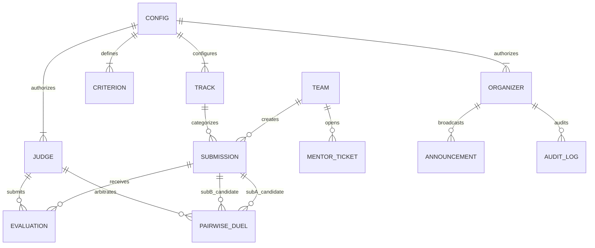
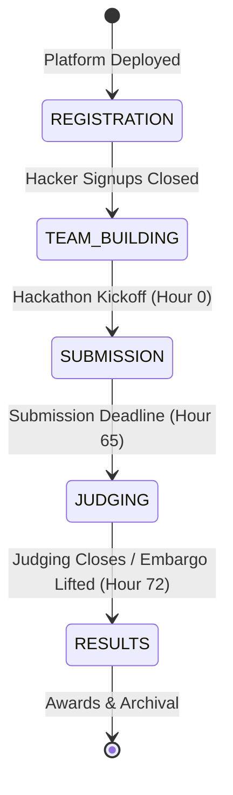
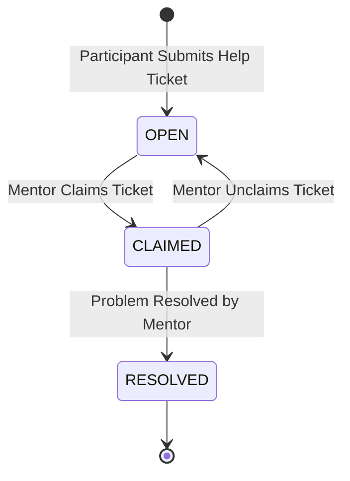

# 📊 Dogfood 2026: Data Model, Schema & Import/Export Specification

> **Comprehensive Technical Reference for Data Collections, Entity Relationships, Storage Architecture, and Import/Export Pipelines**

---

## 📑 Table of Contents

1. [Storage Subsystem Architecture](#1-storage-subsystem-architecture)
2. [Entity Relationship Diagram (ERD)](#2-entity-relationship-diagram-erd)
3. [Core Collection Schemas](#3-core-collection-schemas)
   - [3.1 `config` (Hackathon Configuration, Tracks, Criteria, Judges, Organizers)](#31-config-hackathon-configuration-tracks-criteria-judges-organizers)
   - [3.2 `teams` (Squad Registry & Recruitment)](#32-teams-squad-registry--recruitment)
   - [3.3 `submissions` (Project Gallery & Upvoting)](#33-submissions-project-gallery--upvoting)
   - [3.4 `evaluations` (Rubric Scorecards)](#34-evaluations-rubric-scorecards)
   - [3.5 `pairwiseDuels` (Head-to-Head Arena Records)](#35-pairwiseduels-head-to-head-arena-records)
   - [3.6 `schedule` (Timeline Milestones)](#36-schedule-timeline-milestones)
   - [3.7 `announcements` (Live Broadcast Alerts)](#37-announcements-live-broadcast-alerts)
   - [3.8 `mentorTickets` (24/7 Helpdesk Queue)](#38-mentortickets-247-helpdesk-queue)
   - [3.9 `hackerSeekers` (Skill Matchmaker Directory)](#39-hackerseekers-skill-matchmaker-directory)
   - [3.10 `faqs` (Knowledge Base & AMA Questions)](#310-faqs-knowledge-base--ama-questions)
   - [3.11 `auditLogs` (Immutable Operational Ledger)](#311-auditlogs-immutable-operational-ledger)
4. [Data Export Pipelines & Formats](#4-data-export-pipelines--formats)
   - [4.1 CSV Leaderboard Export (`/api/export/csv`)](#41-csv-leaderboard-export-apiexportcsv)
   - [4.2 JSON Database Snapshot Export (`/api/export/json`)](#42-json-database-snapshot-export-apiexportjson)
5. [Data Ingestion, Reseed & Migration Paths](#5-data-ingestion-reseed--migration-paths)
   - [5.1 Storage File Location & Environment Pathing](#51-storage-file-location--environment-pathing)
   - [5.2 Automated Ingestion & Schema Migration on Boot](#52-automated-ingestion--schema-migration-on-boot)
   - [5.3 Runtime Database Reseed API (`POST /api/hackathon/reset`)](#53-runtime-database-reseed-api-post-apihackathonreset)
   - [5.4 CLI Reseed Script (`npm run seed`)](#54-cli-reseed-script-npm-run-seed)
   - [5.5 Docker Volume Persistence Pathing](#55-docker-volume-persistence-pathing)
6. [Data Lifecycle & State Transitions](#6-data-lifecycle--state-transitions)

---

## 1. Storage Subsystem Architecture

The platform uses an atomic JSON document storage engine ([server/db.js](file:///c:/Users/Rushabh%20Mahajan/Documents/VS%20Code/dogfood-hackathon/server/db.js)) persisted to `data/db.json`:

- **Zero Cloud Footprint**: Operates without external database services (PostgreSQL, MongoDB, Supabase, Firebase).
- **In-Memory Caching (`dbCache`)**: On server initialization, `db.json` is parsed into an in-memory JavaScript object. Read queries (`db.get()`) resolve in sub-millisecond time directly from RAM.
- **Synchronous Write-Through (`db.save(data)`)**: Every mutating API request immediately updates `dbCache` and flushes the full JSON structure synchronously via `fs.writeFileSync`. This guarantees write atomicity and prevents concurrency race conditions.
- **Resilient Fallback**: In the event of disk read errors or JSON syntax corruption, the loader automatically triggers `seedDatabase()`, self-healing the database to guarantee platform uptime.

---

## 2. Entity Relationship Diagram (ERD)



---

## 3. Core Collection Schemas

The root document in `data/db.json` contains 11 top-level keys:

### 3.1 `config` (Hackathon Configuration, Tracks, Criteria, Judges, Organizers)
Root operational configuration for the event.

| Field | Type | Nullable | Default | Description |
|---|---|---|---|---|
| `id` | `String` | No | `"dogfood-2026"` | Unique hackathon slug identifier. |
| `name` | `String` | No | `"Dogfood 2026"` | Display title of the event. |
| `tagline` | `String` | No | — | Brief slogan displayed in the hero banner. |
| `description` | `String` | No | — | Full markdown description of the hackathon rules and vision. |
| `status` | `Enum` | No | `"JUDGING"` | Active phase: `'REGISTRATION'`, `'TEAM_BUILDING'`, `'SUBMISSION'`, `'JUDGING'`, `'RESULTS'`. |
| `totalHours` | `Number` | No | `72` | Total scheduled duration in hours. |
| `startTime` | `String (ISO)`| No | — | ISO 8601 timestamp of hackathon kickoff. |
| `endTime` | `String (ISO)`| No | — | ISO 8601 timestamp of hackathon conclusion. |
| `currentPhaseEnd` | `String (ISO)`| No | — | Target deadline timestamp for active stage countdown. |
| `prizesTotal` | `String` | No | `"$45,000 USD"` | Total prize pool display text. |
| `discordUrl` | `String` | Yes | — | Community chat URL. |
| `githubOrgUrl` | `String` | Yes | — | Official GitHub organization URL. |
| `tracks` | `Array<Track>` | No | `[]` | List of competition tracks (see below). |
| `criteria` | `Array<Criterion>` | No | `[]` | Evaluation criteria (sum of weights must be 100). |
| `judges` | `Array<Judge>` | No | `[]` | Authorized judge personas. |
| `organizers` | `Array<Organizer>` | No | `[]` | Authorized organizer administrators. |

#### Sub-Schema: `Track`
- `id`: `String` (Primary Key, e.g., `"track-core"`)
- `name`: `String` (e.g., `"Grand Prix: Core Platform & Self-Hosting"`)
- `description`: `String`
- `prize`: `String` (e.g., `"$20,000"`)
- `sponsor`: `String` (e.g., `"KernelCorp Systems"`)
- `icon`: `String` (Lucide icon identifier)

#### Sub-Schema: `Criterion`
- `id`: `String` (Primary Key, e.g., `"crit-tech"`)
- `name`: `String` (e.g., `"Technical Execution & Architecture"`)
- `weight`: `Number` (Integer, e.g., `30`)
- `description`: `String`

#### Sub-Schema: `Judge`
- `id`: `String` (Primary Key, e.g., `"judge-1"`)
- `name`: `String` (e.g., `"Dr. Sarah Chen"`)
- `title`: `String` (e.g., `"AI & Systems Lead"`)
- `avatar`: `String` (Image URL)

---

### 3.2 `teams` (Squad Registry & Recruitment)
Tracks registered teams, member rosters, and open positions.

| Field | Type | Nullable | Default | Description |
|---|---|---|---|---|
| `id` | `String` | No | `team-${timestamp}` | Primary Key. |
| `name` | `String` | No | — | Team display name. |
| `track` | `String` | No | — | Foreign key to `config.tracks.id`. |
| `members` | `Array<Member>` | No | `[]` | Member objects: `{ name, role, email }`. |
| `lookingForMembers` | `Boolean` | No | `false` | Recruitment toggle flag. |
| `openRoles` | `Array<String>` | No | `[]` | Role tags needed (e.g., `["Docker Specialist", "Frontend Lead"]`). |

---

### 3.3 `submissions` (Project Gallery & Upvoting)
Projects submitted by teams for evaluation and showcase.

| Field | Type | Nullable | Default | Description |
|---|---|---|---|---|
| `id` | `String` | No | `sub-${timestamp}` | Primary Key. |
| `teamId` | `String` | No | — | Foreign key to `teams.id`. |
| `teamName` | `String` | No | — | Cached team name display. |
| `title` | `String` | No | — | Project title. |
| `tagline` | `String` | Yes | `""` | One-sentence hook. |
| `description` | `String` | No | — | Full project documentation in Markdown format. |
| `track` | `String` | No | — | Foreign key to `config.tracks.id`. |
| `techStack` | `Array<String>` | No | `[]` | Technologies used (e.g., `["Docker", "React 18", "Express"]`). |
| `repoUrl` | `String` | Yes | `""` | Public GitHub / GitLab repository URL. |
| `demoUrl` | `String` | Yes | `""` | Live deployment link. |
| `videoUrl` | `String` | Yes | `""` | YouTube or Loom video walkthrough URL. |
| `logoUrl` | `String` | Yes | default placeholder | Avatar icon URL. |
| `coverUrl` | `String` | Yes | default placeholder | Banner cover image URL. |
| `status` | `Enum` | No | `"SUBMITTED"` | `'DRAFT' \| 'SUBMITTED' \| 'DISQUALIFIED'`. |
| `submittedAt` | `String (ISO)`| No | — | Submission timestamp. |
| `pairwiseScore` | `Number` | No | `1200` | Bradley-Terry Elo score (base: 1200). |
| `upvotes` | `Number` | No | `1` | Community upvote counter. |

---

### 3.4 `evaluations` (Rubric Scorecards)
Individual scorecards submitted by judges.

| Field | Type | Nullable | Default | Description |
|---|---|---|---|---|
| `id` | `String` | No | `eval-${timestamp}` | Primary Key. |
| `judgeId` | `String` | No | — | Foreign key to `config.judges.id`. |
| `judgeName` | `String` | No | — | Evaluator display name. |
| `submissionId` | `String` | No | — | Foreign key to `submissions.id`. |
| `scores` | `Array<ScoreItem>` | No | `[]` | Array of `{ criterionId, score }` where score $\in [1, 10]$. |
| `feedback` | `String` | Yes | `""` | Constructive written critique. |
| `updatedAt` | `String (ISO)`| No | — | Scorecard submission timestamp. |

---

### 3.5 `pairwiseDuels` (Head-to-Head Arena Records)
Outcomes of 1v1 match comparisons arbitrated by judges.

| Field | Type | Nullable | Default | Description |
|---|---|---|---|---|
| `id` | `String` | No | `duel-${timestamp}` | Primary Key. |
| `judgeId` | `String` | No | — | Foreign key to `config.judges.id`. |
| `judgeName` | `String` | No | — | Arbitrating judge name. |
| `subAId` | `String` | No | — | Foreign key to `submissions.id` (Candidate A). |
| `subBId` | `String` | No | — | Foreign key to `submissions.id` (Candidate B). |
| `winnerId` | `String` | No | — | Chosen winner (`subAId` or `subBId`). |
| `timestamp` | `String (ISO)`| No | — | Duel completion timestamp. |

---

### 3.6 `schedule` (Timeline Milestones)
Chronological agenda milestones for the 72-hour timeline.

| Field | Type | Nullable | Default | Description |
|---|---|---|---|---|
| `id` | `String` | No | `sched-${n}` | Primary Key. |
| `title` | `String` | No | — | Milestone title (e.g., `"Mid-Point Hackathon Sync"`). |
| `time` | `String` | No | — | Time display string (e.g., `"Hour 36 (Sept 27, 21:00 UTC)"`). |
| `type` | `String` | No | — | Category: `'CEREMONY'`, `'WORKSHOP'`, `'DEADLINE'`, `'JUDGING'`, `'AMA'`. |
| `completed` | `Boolean` | No | `false` | Whether milestone has passed. |

---

### 3.7 `announcements` (Live Broadcast Alerts)
Broadcast notifications pushed across all client sessions.

| Field | Type | Nullable | Default | Description |
|---|---|---|---|---|
| `id` | `String` | No | `ann-${timestamp}` | Primary Key. |
| `title` | `String` | No | — | Announcement headline. |
| `content` | `String` | No | — | Message content. |
| `tag` | `String` | No | `"INFO"` | Category badge (e.g., `"OPS"`, `"RULES"`, `"URGENT"`). |
| `severity` | `Enum` | No | `"INFO"` | Alert level: `'INFO'`, `'WARNING'`, `'CRITICAL'`. |
| `timestamp` | `String (ISO)`| No | — | Broadcast timestamp. |
| `author` | `String` | No | `"Organizer Ops"` | Sender name. |

---

### 3.8 `mentorTickets` (24/7 Helpdesk Queue)
Tracks technical help requests submitted by hackers.

| Field | Type | Nullable | Default | Description |
|---|---|---|---|---|
| `id` | `String` | No | `ticket-${timestamp}` | Primary Key. |
| `teamName` | `String` | No | — | Requesting team name. |
| `topic` | `String` | No | — | Problem summary. |
| `category` | `String` | No | `"General Help"` | Domain: `'Docker & DevOps'`, `'Frontend'`, `'Backend & DB'`, `'Judging'`. |
| `status` | `Enum` | No | `"OPEN"` | Status: `'OPEN'`, `'CLAIMED'`, `'RESOLVED'`. |
| `claimedBy` | `String` | Yes | `null` | Name/ID of mentor handling ticket. |
| `notes` | `String` | Yes | `""` | Troubleshooting resolution notes. |
| `createdAt` | `String (ISO)`| No | — | Creation timestamp. |
| `resolvedAt` | `String (ISO)`| Yes | `null` | Resolution timestamp. |

---

### 3.9 `hackerSeekers` (Skill Matchmaker Directory)
Profiles of individual hackers seeking a team.

| Field | Type | Nullable | Default | Description |
|---|---|---|---|---|
| `id` | `String` | No | `seeker-${timestamp}` | Primary Key. |
| `name` | `String` | No | — | Developer name. |
| `role` | `String` | No | — | Primary engineering role (e.g., `"Fullstack & DevOps"`). |
| `skills` | `Array<String>` | No | `[]` | Skill keywords (e.g., `["Docker", "React", "Rust"]`). |
| `timezone` | `String` | No | `"UTC"` | Timezone descriptor (e.g., `"UTC-5"`). |
| `github` | `String` | Yes | `""` | GitHub profile URL. |
| `bio` | `String` | Yes | `""` | Short personal bio and goals. |
| `status` | `Enum` | No | `"LOOKING"` | Status: `'LOOKING'`, `'MATCHED'`. |

---

### 3.10 `faqs` (Knowledge Base & AMA Questions)
Frequently asked questions and community AMA queries.

| Field | Type | Nullable | Default | Description |
|---|---|---|---|---|
| `id` | `String` | No | `faq-${timestamp}` | Primary Key. |
| `category` | `String` | No | — | Category (e.g., `"General Rules"`, `"Submission & Demo"`). |
| `question` | `String` | No | — | Question prompt. |
| `answer` | `String` | No | — | Official answer. |
| `askedBy` | `String` | Yes | `"Organizer"` | Participant name if submitted via AMA. |

---

### 3.11 `auditLogs` (Immutable Operational Ledger)
Chronological audit ledger recording system mutations.

| Field | Type | Nullable | Default | Description |
|---|---|---|---|---|
| `id` | `String` | No | `log-${timestamp}` | Primary Key. |
| `action` | `String` | No | — | Action code (`'PHASE_UPDATED'`, `'NEW_SUBMISSION'`, `'RUBRIC_EVALUATION'`, `'PAIRWISE_DUEL'`, `'ANNOUNCEMENT_BROADCAST'`). |
| `detail` | `String` | No | — | Human-readable explanation. |
| `timestamp` | `String (ISO)`| No | — | Action timestamp. |

---

## 4. Data Export Pipelines & Formats

The platform provides two dedicated endpoints under `server/routes/export.js` for post-event auditability and archival.

### 4.1 CSV Leaderboard Export (`/api/export/csv`)
- **HTTP Method**: `GET`
- **Output File**: `dogfood-2026-leaderboard.csv`
- **Content-Type**: `text/csv`
- **Header**:
  ```csv
  Rank,Title,Team,Track,Normalized Score,Raw Average,Pairwise Elo,Evaluations Count,Repo URL,Demo URL
  ```
- **Processing Logic**:
  1. Retrieves all active submissions, evaluations, and criteria.
  2. Invokes `normalizeScoresAcrossJudges()` on-the-fly to calculate current normalized rankings, Z-score standardizations, and composite scores.
  3. Sanitizes and escapes fields according to RFC 4180 (double quotes escaped as `""`).
  4. Streams the compiled CSV directly to the browser with `Content-Disposition: attachment; filename="dogfood-2026-leaderboard.csv"`.

#### Sample Output Line:
```csv
1,"Autonomous Agent OS","CyberPioneers","track-core",88.45,8.95,1248,3,"https://github.com/cyber/os","https://os.cyber.dev"
```

---

### 4.2 JSON Database Snapshot Export (`/api/export/json`)
- **HTTP Method**: `GET`
- **Output File**: `dogfood-2026-export.json`
- **Content-Type**: `application/json`
- **Processing Logic**:
  1. Calls `db.get()` to retrieve the complete in-memory dataset.
  2. Serializes the entire data structure (`config`, `teams`, `submissions`, `evaluations`, `pairwiseDuels`, `schedule`, `announcements`, `mentorTickets`, `hackerSeekers`, `faqs`, `auditLogs`) into formatted JSON (`null, 2`).
  3. Streams the complete unembargoed snapshot directly to the client with `Content-Disposition: attachment; filename="dogfood-2026-export.json"`.

---

## 5. Data Ingestion, Reseed & Migration Paths

### 5.1 Storage File Location & Environment Pathing
The active database file path is resolved dynamically in `server/db.js`:
```javascript
const DATA_DIR = process.env.DATA_DIR 
  ? path.resolve(process.env.DATA_DIR) 
  : path.resolve(__dirname, '../data');
const DB_FILE = path.join(DATA_DIR, 'db.json');
```
- In local development: Stored at `<project-root>/data/db.json`.
- In Docker containers: Stored at `/app/data/db.json`.

---

### 5.2 Automated Ingestion & Schema Migration on Boot
When `loadDatabase()` executes on server start:
1. **File Existence Check**: Verifies if `DB_FILE` exists.
   - If not found, calls `seedDatabase()` immediately to create `data/db.json` from `server/seedData.js`.
2. **Schema Ingestion & Backward Compatibility**:
   - If reading an older version of `db.json`, it checks for newly added collections:
     ```javascript
     if (!dbCache.schedule) { dbCache.schedule = [...initialSchedule]; modified = true; }
     if (!dbCache.announcements) { dbCache.announcements = [...initialAnnouncements]; modified = true; }
     if (!dbCache.mentorTickets) { dbCache.mentorTickets = [...initialMentorTickets]; modified = true; }
     if (!dbCache.hackerSeekers) { dbCache.hackerSeekers = [...initialHackerSeekers]; modified = true; }
     if (!dbCache.faqs) { dbCache.faqs = [...initialFaqs]; modified = true; }
     if (modified) saveDatabase(dbCache);
     ```
   - Injects default collections seamlessly and persists changes back to disk without data loss.
3. **Parse Error Self-Healing**: If `JSON.parse()` throws an exception (due to file corruption or manual syntax errors), the catch block logs the error and re-seeds the database automatically.

---

### 5.3 Runtime Database Reseed API (`POST /api/hackathon/reset`)
- **HTTP Method**: `POST`
- **Route**: Mounted in `server/routes/hackathon.js`.
- **Action**: Calls `db.reset()`, which clones fresh seed objects from `server/seedData.js` and flushes them to `data/db.json`.
- **Response**:
  ```json
  {
    "success": true,
    "message": "Database reset to default Dogfood 2026 state.",
    "config": { ... }
  }
  ```

---

### 5.4 CLI Reseed Script (`npm run seed`)
Organizers can reseed the database directly from the terminal without launching the server:
```bash
npm run seed
```
This executes:
```bash
node -e "import('./server/db.js').then(m => m.seedDatabase())"
```
It reads `server/seedData.js`, constructs the full 11-collection dataset, and writes it directly to `data/db.json`.

---

### 5.5 Docker Volume Persistence Pathing
In `docker-compose.yml`, persistent storage is bound to the named Docker volume `dogfood_data`:
```yaml
services:
  dogfood-platform:
    volumes:
      - dogfood_data:/app/data

volumes:
  dogfood_data:
    name: dogfood_hackathon_data
```
This guarantees that container rebuilds, restarts, and updates never destroy user-submitted projects, scorecards, or ticket data.

---

## 6. Data Lifecycle & State Transitions

### Lifecycle State Machine Diagram


### Mentorship Ticket State Machine Diagram

